# reproduction-webpack-css-order

This repository demonstrates a CSS order issue in Webpack 5 when using a pnpm monorepo with `sideEffects: false` in package.json files.

## The Issue

When `sideEffects: false` is set in package.json files across a monorepo, CSS import order becomes unpredictable.

## Steps to Reproduce

1. Clone the repository
```bash
git clone https://github.com/jantimonpn/reproduction-webpack-css-order.git
cd reproduction-webpack-css-order
```

2. Install dependencies
```bash
pnpm install
```

3. Build 
```bash
pnpm build
```

4. See CSS output in `@applications/base/dist`:
The `background-color: orange;` is not the last rule in the CSS file:

```css
.hDE5PT5V3QGAPX9o9iZl {
  padding: 20px;
  border: 1px solid #ddd;
  border-radius: 8px;
  margin: 16px;
}

.yqrxTjAG22vkATE1VjR9 {
  background-color: orange;
}

.R_y25aX9lTSLQtlxA1c9 {
  padding: 8px 16px;
  background-color: #007bff;
  color: white;
  border: none;
  border-radius: 4px;
}
```
  
5. Replace `"sideEffects": false` with `"sideEffects": true` in all `package.json` files
(or switch to the `side-effects-true` branch)
```bash
git checkout -b side-effects-true
```


6. Build again
```bash
pnpm build
```

7. See CSS output in `@applications/base/dist`:
 The `background-color: orange;` is now the last rule in the CSS file


```css
.R_y25aX9lTSLQtlxA1c9 {
  padding: 8px 16px;
  background-color: #007bff;
  color: white;
  border: none;
  border-radius: 4px;
}

.hDE5PT5V3QGAPX9o9iZl {
  padding: 20px;
  border: 1px solid #ddd;
  border-radius: 8px;
  margin: 16px;
}

.yqrxTjAG22vkATE1VjR9 {
  background-color: orange;
}
```

## Project Structure

```
├── @applications/base
├── @libraries/teaser
└── @segments/carousel
```

Each package has `sideEffects: false` in its package.json, which triggers the issue.

## Environment

- Webpack 5
- pnpm
- Node.js >= 20
- All packages have `sideEffects: false`

## Module Graphs

```mermaid
graph TD
    subgraph "sideEffects: false"
        A1["@applications/base/src/index.ts\n preOrder: 0, postOrder: 6"]
        B1["@libraries/teaser/src/teaser.ts\n preOrder: 1, postOrder: 5"]
        C1["@libraries/teaser/src/teaser.module.css\n preOrder: 2, postOrder: 1"]
        D1["teaser.module.css|0|||}}\n preOrder: 3, postOrder: 0"]
        E1["@segments/carousel/src/buttons.ts\n preOrder: 4, postOrder: 4"]
        F1["@segments/carousel/src/button.module.css\n preOrder: 5, postOrder: 3"]
        G1["button.module.css|0|||}}\n preOrder: 6, postOrder: 2"]
        
        A1 --> B1
        B1 --> C1
        C1 --> D1
        B1 --> E1
        E1 --> F1
        F1 --> G1

        style A1 fill:#AA5,stroke:#333
        style C1 fill:#cfe,stroke:#333
        style D1 fill:#cfe,stroke:#333
        style F1 fill:#cfe,stroke:#333
        style G1 fill:#cfe,stroke:#333
    end

    subgraph "sideEffects: true"
        A2["@applications/base/src/index.ts\n preOrder: 0, postOrder: 8"]
        B2["@libraries/teaser/src/index.ts\n preOrder: 1, postOrder: 7"]
        C2["@libraries/teaser/src/teaser.ts\n preOrder: 2, postOrder: 6"]
        D2["@segments/carousel/src/index.ts\n preOrder: 3, postOrder: 3"]
        E2["@segments/carousel/src/buttons.ts\n preOrder: 4, postOrder: 2"]
        F2["@segments/carousel/src/button.module.css\n preOrder: 5, postOrder: 1"]
        G2["button.module.css|0|||}}\n preOrder: 6, postOrder: 0"]
        H2["@libraries/teaser/src/teaser.module.css\n preOrder: 7, postOrder: 5"]
        I2["teaser.module.css|0|||}}\n preOrder: 8, postOrder: 4"]
        
        A2 --> B2
        B2 --> C2
        C2 --> D2
        D2 --> E2
        E2 --> F2
        F2 --> G2
        C2 --> H2
        H2 --> I2

        style A2 fill:#AA5,stroke:#333
        style F2 fill:#cfe,stroke:#333
        style G2 fill:#cfe,stroke:#333
        style H2 fill:#cfe,stroke:#333
        style I2 fill:#cfe,stroke:#333
    end
```

